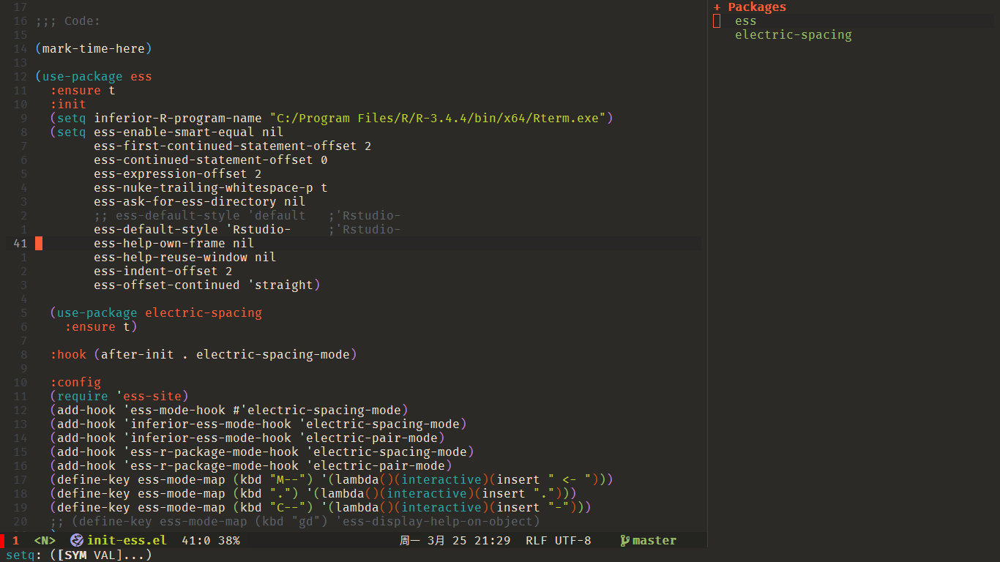

# UNICORN

---
### Unicorn is a emacs based programming editor with evil (a vim emulator), try to provide immersive programming experience, enjoy !!

## Prerequisites

download emacs for [windows](https://github.com/m-parashar/emax64) specially, for linux make a normal download and compile

Unicorn requires fonts for better display

- Fonts
  - [Fira Code](https://github.com/tonsky/FiraCode)
  - [Fira Code Symbol](https://github.com/tonsky/FiraCode/files/412440/FiraCode-Regular-Symbol.zip)
  - [all the icons](https://github.com/domtronn/all-the-icons.el/tree/master/fonts)  

- git config
``` shell
# make sure git add proxy before installing, especially for quelpa mechanism
git config --http.proxy http://127.0.0.1:1080
git config --https.proxy https://127.0.0.1:1080

# if need to store user.name and password
git config --global user.name xxx
git config --global user.email xxx
git config --global credential.helper store
```

- global tools
  - [ripgrep](https://github.com/BurntSushi/ripgrep) in your $PATH for windows user, for ubuntu user

``` shell
sudo apt install ripgrep
```

- Python related Packages
```shell
pip install pylint yapf isort
```

- R language server
``` shell
# add Rterm to system path first for ess mode
install.packages("devtools")
devtools::install_github("REditorSupport/languageserver")")
```

- Markdown support
``` shell
sudo apt install markdown
```

- C/C++ packages
  - build [ccls](https://github.com/MaskRay/ccls) language server at $HOME path

- nodejs packages
```shell
npm install -g eslint_d prettier markdownlint-cli vmd
```

- vterm shell
  - only for *nix system, refer [here](https://github.com/akermu/emacs-libvterm)
``` shell
sudo apt install cmake
sudo apt install libtool
sudo apt install libtool-bin
```

use mirror if you have timeout error.

## Install
Unicorn is trying to mimic and simplify spacemacs, and simpler for management, you can copy from the following hub using git the following way, enjoy it!!

```shell
git clone git@github.com:peter159/unicorn.git ~/.emacs.d
```

For server user, since emacs is running a deamon for server, make a short cut applying something like the below to use it(change the path to your path). Look at [wiki](https://www.emacswiki.org/emacs/EmacsMsWindowsIntegration) to see the explanation of how emacsclient works

```shell
# make a shortcut in windows using this path
C:\msys64\mingw64\bin\emacsclientw.exe -cna C:\msys64\mingw64\bin\runemacs.exe
```
Fonts, is sometimes critical for UI thing, here recommend to use `Fira Code Retina` for English and `µÈ¾à¸üÉ´ºÚÌå SC` for Chinese, can download them from here
> [Fira Code Retina-%S](https://github.com/tonsky/FiraCode/releases/download/1.206/FiraCode_1.206.zip)
> [Fira Code Symbols](https://github.com/tonsky/FiraCode/files/412440/FiraCode-Regular-Symbol.zip)
> [Sarasa-Gothic](https://github.com/be5invis/Sarasa-Gothic/releases/download/v0.7.2/sarasa-gothic-ttf-0.7.2.7z) #install all that with -sc-

## SNAPSHOT


## Notes

* tested in emacs 28.05, Ubuntu 20.04, 20210116
* tested in emacs 27.1, windows 10, 20210117, can also download and use unicorn-windows repo as well


