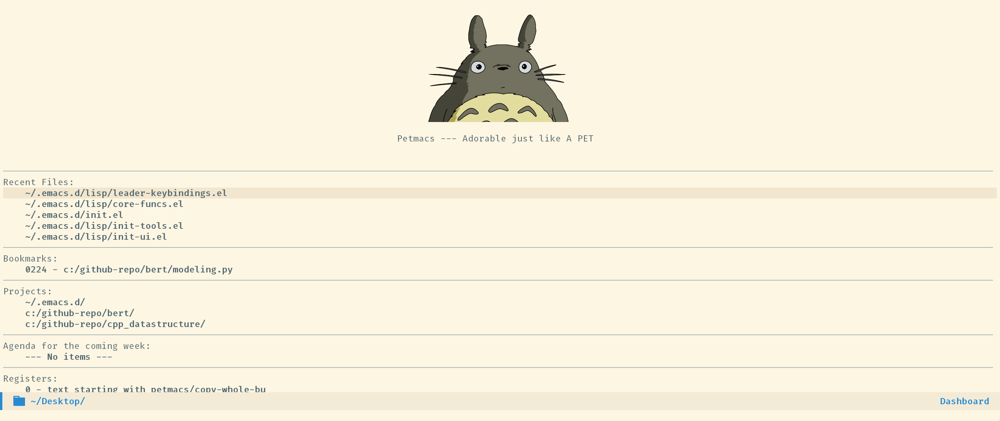
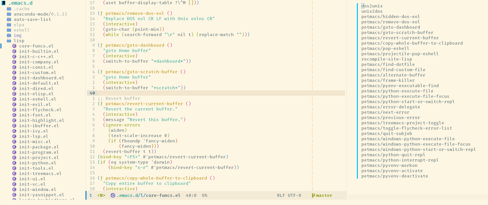

# Install

```bash
git clone https://github.com/Peter159/petmacs.git ~/.emacs.d
```

```firacode and symbol
https://github.com/tonsky/FiraCode
https://github.com/tonsky/FiraCode/files/412440/FiraCode-Regular-Symbol.zip
```
---

# Screenshot




